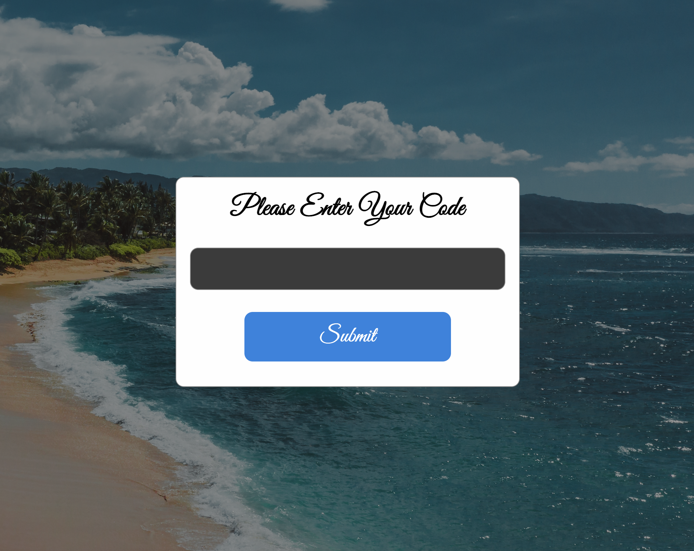
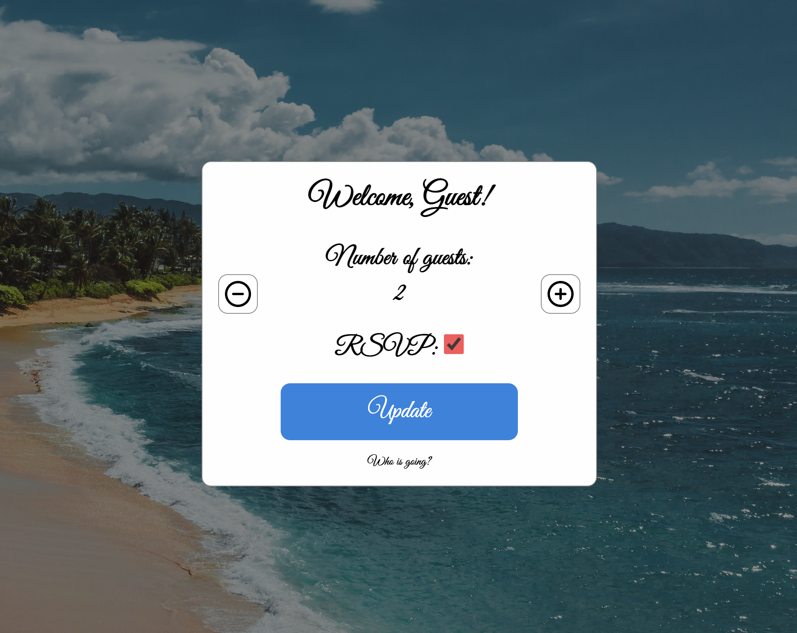
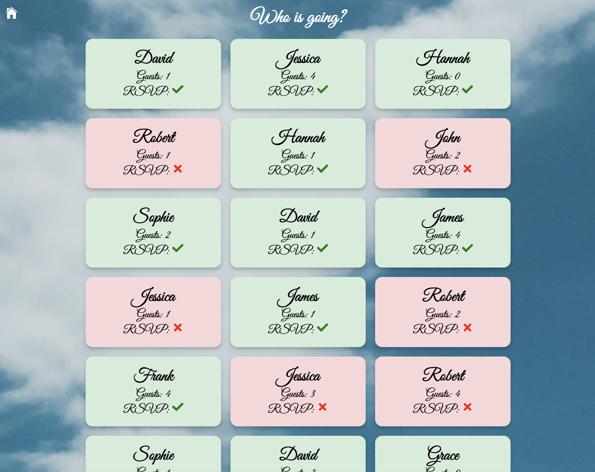

# Wedding-Invites





This is a [Next.js](https://nextjs.org/) project that helps you to manage your wedding invites. It leverages Firebase for backend operations including data storage via Firestore and user authentication via Anonymous Auth. The project is bootstrapped with [`create-next-app`](https://github.com/vercel/next.js/tree/canary/packages/create-next-app).

## Project Setup

Firstly, clone the repository with:

```
git clone https://github.com/<your_username>/wedding-invites.git
cd wedding-invites
```

### Firebase Configuration

This application uses Firebase for backend services. Therefore, it's essential to set up Firebase correctly.

In order to run this application, you need to set up a Firebase project, enable Firestore and anonymous authentication, then obtain your Firebase SDK credentials.

You will find below the setup guide for Firebase.

1. Create a Firebase project in the [Firebase console](https://console.firebase.google.com/).
2. Enable Firestore in your Firebase project.
3. Enable Anonymous Auth under the 'Authentication' section of your Firebase project.
4. Copy your Firebase SDK snippet from your project settings and replace the fields in `firebaseConfig` in your local environment file.

Here is an example of how your `firebaseConfig` should look like:

```
const firebaseConfig = {
  apiKey: "your_firebase_api_key",
  authDomain: "your_firebase_auth_domain",
  projectId: "your_firebase_project_id",
  storageBucket: "your_firebase_storage_bucket",
  messagingSenderId: "your_firebase_messaging_sender_id",
  appId: "your_firebase_app_id",
};
```

### Environment Variables

The project uses environment variables to securely store the Firebase credentials. Copy the `.env.example` file to `.env.local` in the root of the project.

```
cp .env.example .env.local
```

Then, replace the placeholders with your actual Firebase credentials:

```
NEXT_PUBLIC_FIREBASE_API_KEY=your_firebase_api_key
NEXT_PUBLIC_FIREBASE_AUTH_DOMAIN=your_firebase_auth_domain
NEXT_PUBLIC_FIREBASE_PROJECT_ID=your_firebase_project_id
NEXT_PUBLIC_FIREBASE_STORAGE_BUCKET=your_firebase_storage_bucket
NEXT_PUBLIC_FIREBASE_MESSAGING_SENDER_ID=your_firebase_messaging_sender_id
NEXT_PUBLIC_FIREBASE_APP_ID=your_firebase_app_id
```

### Running the App

After setting up your Firebase credentials, you can now run the app:

```
npm install
npm run dev
# or
yarn install
yarn dev
# or
pnpm install
pnpm dev
```

Open [http://localhost:3000](http://localhost:3000) with your browser to see the result. You can start editing the page by modifying `app/page.tsx`. The page auto-updates as you edit the file.

This project uses [`next/font`](https://nextjs.org/docs/basic-features/font-optimization) to automatically optimize and load Inter, a custom Google Font.

## Learn More

To learn more about Next.js, take a look at the following resources:

- [Next.js Documentation](https://nextjs.org/docs) - learn about Next.js features and API.
- [Learn Next.js](https://nextjs.org/learn) - an interactive Next.js tutorial.

You can check out [the Next.js GitHub repository](https://github.com/vercel/next.js/) - your feedback and contributions are welcome!

## Deployment

The easiest way to deploy your Next.js app is to use the [Vercel Platform](https://vercel.com/new?utm_medium=default-template&filter=next.js&utm_source=create-next-app&utm_campaign=create-next-app-readme) from the creators of Next.js.

Check out our [Next.js deployment documentation](https://nextjs.org/docs/deployment) for more details.

## Contributing

Pull requests are welcome. For major changes, please open an issue first to discuss what you would like to change.

## License

[MIT](https://choosealicense.com/licenses/mit/)

# Feature Checklist

Here's an overview of the key features that have been implemented and those that are yet to be added to the project:

## Implemented Features

- [x] Individual invite management
- [x] "See who is attending" page

## To-Do Features

- [ ] Admin Dashboard: An admin interface to manage invites, monitor activities, and perform administrative tasks.
- [ ] Email Reminders: An automated system to send out reminders to the guests. It will notify them about the event details and their RSVP status.
